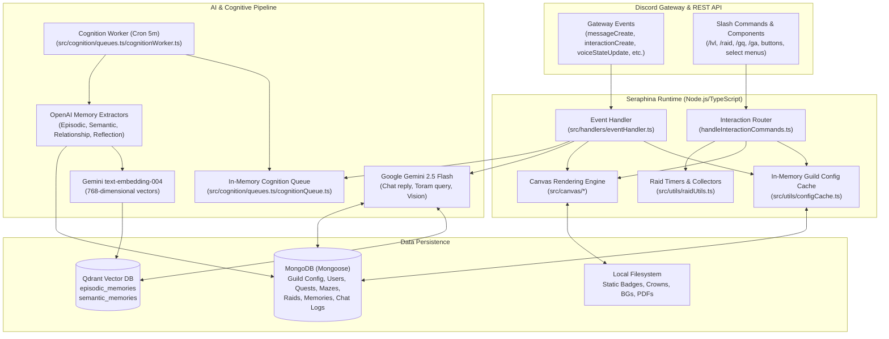
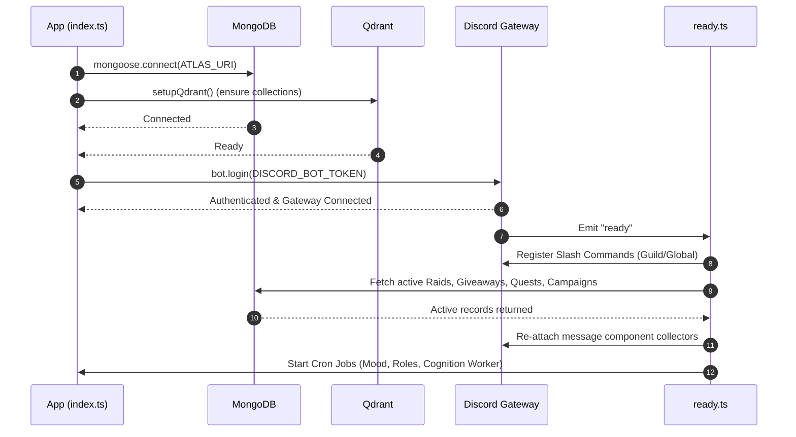
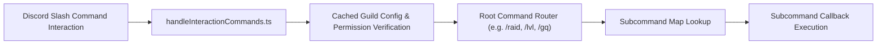

# Seraphina System Architecture

Seraphina is a Discord application built with TypeScript, Node.js (CommonJS), Discord.js v14, MongoDB (Mongoose), Qdrant Vector Database, Google Gemini (`@google/genai`), OpenAI SDK, and Canvas graphics.

This document details the architectural layers, system lifecycle, runtime data flows, storage backends, and background processing systems that make up Seraphina.

---

## 1. High-Level Architectural Overview

Seraphina operates as an event-driven bot combining real-time community engagement tools (leveling, moderation, raids, giveaways, quest workflows) with a cognitive AI assistant capable of multi-layered psychological memory and dynamic mood personality adaptation.

---

## 2. Application Startup & Initialization Flow

When Seraphina boots (`src/index.ts`):
1. **Environment Setup**: Detects `NODE_ENV` (defaults to `development`) and loads `.env.<NODE_ENV>`.
2. **Event Registration**: Initializes `eventHandler(bot)`, which recursively scans `src/events/` and registers listeners for Discord gateway events.
3. **Database & Vector Initialization**: Runs `Promise.all()` connecting to MongoDB via Mongoose and ensuring required vector collections exist in Qdrant (`setupQdrant()`).
4. **Discord Gateway Login**: Authenticates with `bot.login(process.env.DISCORD_BOT_TOKEN)`.
5. **Gateway Ready Hook**:
   - On the `ready` event (`src/events/ready/ready.ts`), dynamic slash commands in `src/commands/` are loaded, validated against Discord's application command endpoint, and registered:
     - **Development**: Registered only to `Seraphina Development Server`.
     - **Production**: Registered globally across Discord.
   - Restores persistent state: re-attaches message collectors and timers for active raids, pending giveaways, community support campaigns, and guild quest/maze review messages.
   - Starts cron jobs (`src/jobs/cron/`):
     - Daily mood rotation at midnight (`0 0 * * *`).
     - Daily giveaway role refresh at midnight (`0 0 * * *`).
     - Cognition queue drain worker every 5 minutes (`*/5 * * * *`).

---

## 3. Discord Event Architecture

Event handling (`src/handlers/eventHandler.ts`) organizes listeners by folder names matching Discord.js event names:

* `src/events/messageCreate/`:
  * `handleMessageEvents.ts`: Leveling engine. Validates ignored channels and cooldowns, calculates text and attachment XP, issues level promotions, and posts level-up cards.
  * `handleSeraphinaTalk.ts`: Responds to `s!` or `S!` prefix. Gathers Discord history and retrieves relevant memories from Qdrant + Mongo, generates AI response with mood styling, responds to the channel, and queues conversation into `CognitionQueue`.
  * `handleToramQuery.ts`: Responds to `t!` or `T!` prefix. Performs fuzzy keyword matching via Fuse.js against Toram PDF knowledge bases and answers using Gemini.
* `src/events/interactionCreate/`:
  * `handleInteractionCommands.ts`: Routes `/slash` commands by category and subcommand, enforcing admin/manager permissions and channel restrictions.
  * `handleModalSubmissions.ts`: Processes modal submission inputs for guild quest uploads, maze runs, and community support tickets.
* `src/events/voiceStateUpdate/`:
  * `handleVoiceStateUpdate.ts`: Tracks voice channel time, calculating voice XP per minute and handling level promotions.
* `src/events/guildMemberAdd/` & `guildMemberRemove/`:
  * Manages automatic welcome cards, user creation, farewell announcements, and server boost notifications.
* `src/events/guildCreate/` & `guildDelete/`:
  * Initializes default guild configuration (`configSchema`) on joining, or cleans up configuration on removal.

---

## 4. Slash Command System & Subcommand Tree

Commands are discovered dynamically via `getLocalCommands()` (`src/utils/getLocalCommands.ts`). Top-level categories export an `init()` function returning an `ICommandObj`. Subcommands are organized in subdirectories (`subcommands/admin`, `subcommands/user`, `subcommands/owner`) and fetched using `fetchAllSubcommands()`:

### Command Routing & Permissions
1. **Developer-Only**: Validates caller against `devsIDs` array.
2. **Bot-Admin**: Validates caller against `moderationConfig.botAdminIDs`.
3. **Manager Role**: Validates whether caller possesses designated subsystem management roles (`isManager(client, userId, guildId, subsystem)`).
4. **Channel Enforcement**: Automatically enforces that subsystem commands are executed exclusively within their configured channel (e.g. `raidChannelID`, `gquestChannelID`, `supportChannelID`), exempting bot admins.

---

## 5. Storage & Persistence Architecture

### MongoDB (Mongoose)
Primary operational store managing relational entities and structured memories:
* **Guild & User Configuration**: `ConfigSchema`, `UserSchema`.
* **Subsystem Entities**: `RaidSchema`, `GiveawaySchema`, `GuildQuestsSchema`, `MazeSchema`, `CommunitySupportSchema`.
* **Conversational Records**: `ChatMemorySchema` (conversation message history).
* **Cognitive Memory Store**:
  * `EpisodicMemorySchema`: Event-based memories.
  * `SemanticMemorySchema`: General knowledge and world beliefs.
  * `RelationshipStateSchema`: Psychological bond metrics (trust, attachment, traits).
  * `ReflectiveMemorySchema`: Seraphina's introspective reflections.

### Qdrant Vector Database
Qdrant manages vector embeddings ($768$-dimensional vectors generated via Gemini `text-embedding-004`):
* `episodic_memories`: Vectorized episodic summaries filtered by payload `{ userID, type: "episodic" }`.
* `semantic_memories`: Vectorized beliefs/truths filtered by payload `{ userID, type: "semantic" }`.
* Payloads store a foreign reference `vector_embed_id` linking the vector point back to MongoDB documents.

---

## 6. Background Processing & Scheduled Jobs

Seraphina avoids blocking the event loop or user responses by dispatching long-running work to cron jobs and queues:

1. **Cognition Processing Queue (`CognitionQueue`)**:
   * Immediate user interaction returns the AI reply first.
   * Interaction text and user ID are pushed to `CognitionQueue`.
   * The cognition cron worker runs every 5 minutes (`src/cognition/queues.ts/cognitionWorker.ts`), acquiring an execution lock and draining all pending cognition jobs sequentially.
2. **Daily Mood Rotation**:
   * Triggers daily at 00:00 JST via `node-cron` (`src/jobs/cron/dailyMoodUpdate.ts`).
   * Randomly selects a mood from 17 supported personality profiles (e.g. `serene`, `tsundere`, `playful`, `divinePride`), persisting it across guild configurations.
3. **Daily Giveaway Role Demotion/Promotion**:
   * Triggers daily at 00:00 JST (`src/jobs/cron/giveawayRoleCheck.ts`), reviewing member activity and leveling stats to adjust eligible giveaway access tiers.
4. **Raid Lifecycle Timers**:
   * Node `setTimeout` timers are registered per raid for automated reminders: scout reminder (24h before), team allocation (1h before), participant reminder (30m before), and review reminder (3h after).

---

## 7. Performance & Caching Architecture

Seraphina employs multi-layer caching to ensure fast Discord response times:

* **Guild Configuration Cache (`src/utils/configCache.ts`)**:
  * In-memory cache with a 60-second TTL backed by Mongoose post-hooks (`save`, `findOneAndUpdate`, `updateOne`, `findOneAndDelete`) that trigger immediate cache invalidation.
* **Local Commands Cache (`src/utils/getLocalCommands.ts`)**:
  * Command filesystem scanning and dynamic imports run once and remain cached in memory.
* **Knowledge Base Fuse Singletons**:
  * Command and Toram JSON knowledge bases and their Fuse fuzzy search indices are created once at module load time.
* **Static Canvas Asset Cache (`src/canvas/utils/staticAssetCache.ts`)**:
  * Decoded images for crowns, medals, default avatars, and backgrounds are held in memory as static `Image` instances, preventing repeated disk directory scans and JPEG/PNG decoding.
* **Concurrent I/O Operations**:
  * Memory retrieval queries (Qdrant search, relationship state, reflections) and Discord channel history fetches execute in parallel via `Promise.all()`.
  * Tile avatar network downloads across all 10 leaderboard entries are fetched concurrently before canvas drawing.
