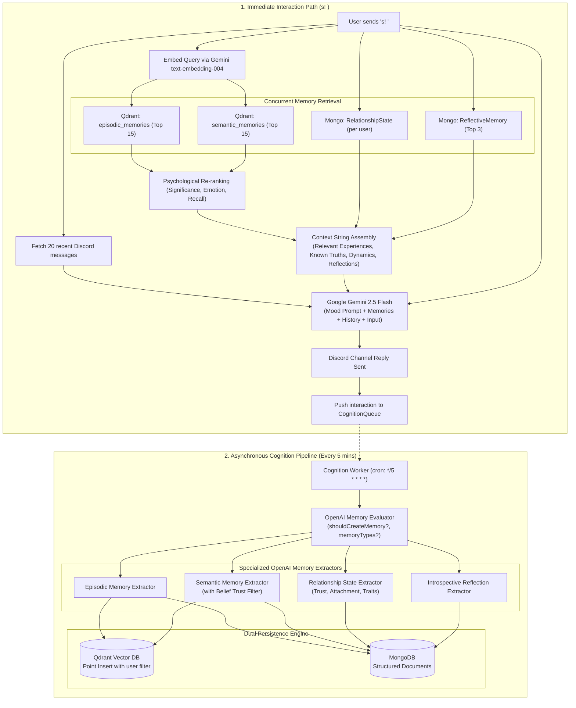
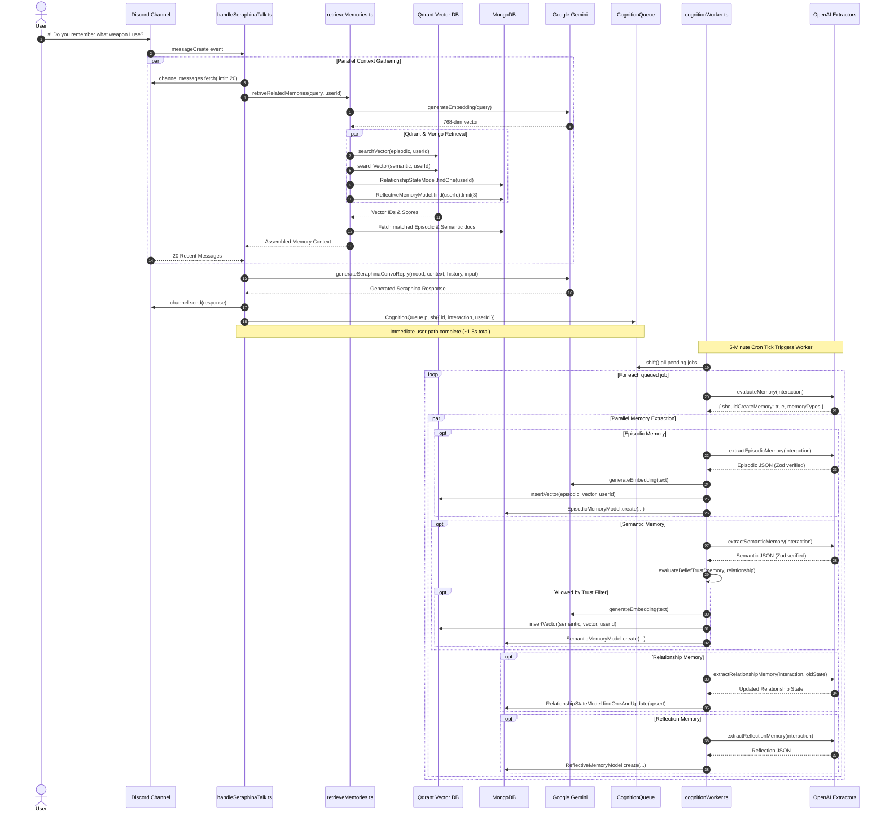
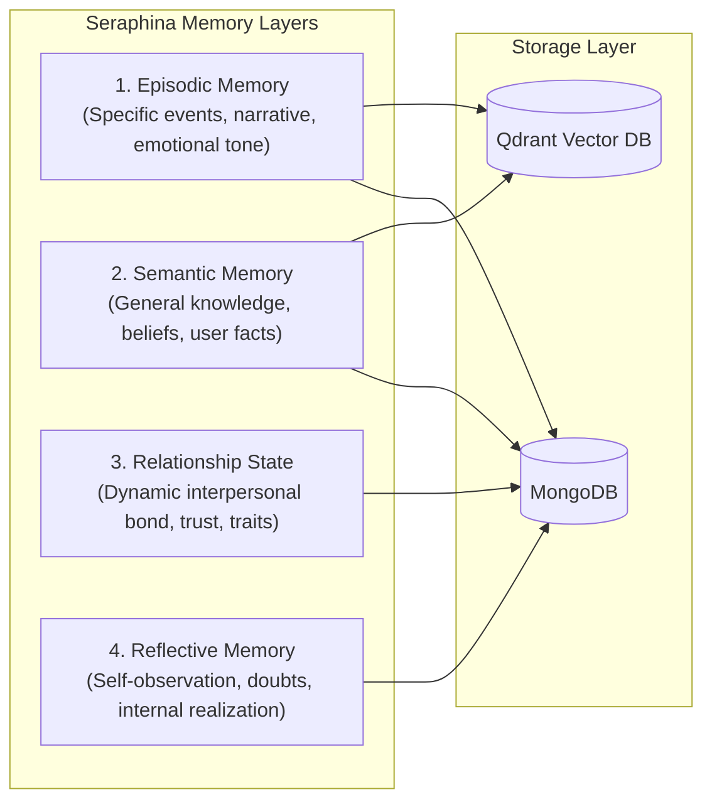

# Seraphina Cognitive Pipeline & Memory Architecture

This document describes how Seraphina perceives conversations, retrieves context, formulates mood-aligned replies, and processes memories in the background to build continuous interpersonal relationships over time.

---

## 1. High-Level Cognitive Architecture

Seraphina separates **immediate response generation** (synchronous user path) from **cognitive memory synthesis** (asynchronous background worker).

---

## 2. Interaction Lifecycle Sequence

The following sequence diagram outlines a full round-trip conversational exchange from trigger to background memory persistence:

---

## 3. Four-Layer Memory Architecture

Seraphina organizes memory into four distinct psychological layers:

### 1. Episodic Memory (`EpisodicMemorySchema`)
* **Purpose**: Records autobiographical moments, shared events, conversations, and emotional scenes.
* **Storage**: MongoDB (`episodicmemorymodels`) + Qdrant collection `episodic_memories`.
* **Key Fields**:
  * `event`: Short title/slug.
  * `summary`: Concrete description of what occurred.
  * `significance`: Rating from $0.0$ to $1.0$.
  * `emotionalTone`: Description of the interaction vibe (e.g. humorous, stressful, heartwarming).
  * `emotions`: Map of emotional intensities (`joy`, `trust`, `anticipation`, `surprise`, `anger`, etc.).
  * `vector_embed_id`: Foreign key matching Qdrant vector point ID.

### 2. Semantic Memory (`SemanticMemorySchema`)
* **Purpose**: Stores general knowledge, user preferences, world truths, and persistent personal facts (e.g. "User main class is Halberd", "User dislikes boss raids").
* **Storage**: MongoDB (`semanticmemorymodels`) + Qdrant collection `semantic_memories`.
* **Key Fields**:
  * `concept`: Subject keyword or topic.
  * `statement`: Canonical statement representing the learned knowledge.
  * `confidence`: Float between $0.0$ and $1.0$.
  * `significance`, `emotionalIntensity`, `recallStrength`.
  * `vector_embed_id`: Foreign key matching Qdrant point ID.
* **Belief Trust Filter**: Before a semantic memory is saved, `evaluateBeliefTrust` validates the user's relationship trust score to prevent deceptive or malicious inputs from overwriting Seraphina's core beliefs.

### 3. Relationship Memory (`RelationshipStateSchema`)
* **Purpose**: A persistent, evolving psychological model of Seraphina's bond with a specific user.
* **Storage**: MongoDB (`relationshipstateschemas`), uniquely keyed per user ID (`{ user_id: string }`).
* **Key Metrics**:
  * `attachmentLevel` ($0.0 - 1.0$): Depth of emotional bonding.
  * `trustLevel` ($0.0 - 1.0$): Reliability and honesty threshold.
  * `familiarityLevel` ($0.0 - 1.0$): How well Seraphina knows the user.
  * `emotionalSafety` ($0.0 - 1.0$): Comfort level in vulnerability.
* **Narrative Fields**:
  * `overallImpression`: Qualitative summary of the user.
  * `perceivedTraits`: Observed personality traits (e.g. ["loyal", "competitive", "blunt"]).
  * `communicationPatterns`: How the user speaks (e.g. ["uses sarcasm", "succinct", "asks technical questions"]).
  * `recurringDynamics`: Shared conversational tropes.
  * `insideJokes`: Running jokes established with this user.
  * `relationshipNarrative`: Running paragraph describing the history of their friendship.

### 4. Reflective Memory (`ReflectiveMemorySchema`)
* **Purpose**: Self-directed introspective thoughts where Seraphina reflects upon her own behavior, biases, insecurities, or growth.
* **Storage**: MongoDB (`reflectivememorymodels`), indexed by `{ user_id: 1, updatedAt: -1 }`.
* **Key Fields**:
  * `trigger`: What caused the reflection.
  * `selfObservation`: Realization about her own behavior or feelings.
  * `growth`: How she intends to adapt or behave differently in future interactions.

---

## 4. Context Retrieval & Psychological Re-Ranking

When Seraphina is addressed (`s!`), memories are retrieved through hybrid vector similarity and psychological scoring:

1. **Vector Search in Qdrant**:
   * Gemini `text-embedding-004` converts the current interaction into a 768-dimensional query vector.
   * Qdrant executes cosine similarity search filtering by payload `userID == author.id` on both `episodic_memories` and `semantic_memories`, returning the top 15 candidates with vector scores $S_{vector} \in [0, 1]$.
2. **Psychological Score Re-Ranking (`getFinalScore`)**:
   Instead of relying solely on cosine similarity, Seraphina weighs psychological attributes stored in MongoDB:
   $$\text{FinalScore} = (0.50 \times S_{vector}) + (0.20 \times \text{Significance}) + (0.20 \times \text{EmotionalIntensity}) + (0.10 \times \text{RecallStrength})$$
   * The top 5 ranked memories are selected for prompt injection.
3. **Structured Prompt Assembly**:
   Retrieved context is combined into markdown sections:
   * `## Relevant Experiences`: Past episodic memories and emotional tones.
   * `## Known Truths`: Verified semantic statements about the user.
   * `## Relationship Context`: Current trust/attachment score, traits, communication style, inside jokes.
   * `## Personal Reflections`: Top 3 recent self-observations.

---

## 5. Dynamic Mood System

Seraphina's conversational style adapts daily based on 17 mood states:

| Mood | Behavioral Persona & Tone |
|---|---|
| `serene` | Calm, poetic, deeply patient, centered. |
| `tsundere` | Feigns annoyance, easily embarrassed, defensive yet supportive. |
| `tired` | Low-energy, blunt, sighs, reluctant to overexert. |
| `divinePride` | Majestic, regal, speaks with divine authority and elegance. |
| `cheerful` | Enthusiastic, radiant, warm, high energy. |
| `cold` | Precise, clinical, emotionally guarded, minimalistic. |
| `dreamy` | Whimsical, spacey, speaks in metaphors and abstract thoughts. |
| `gentle` | Soft-spoken, comforting, empathetic, nurturing. |
| `gloomy` | Melancholic, brooding, focuses on transient sorrow. |
| `manic` | Hyper-active, fast-paced, erratic, unpredictable. |
| `mischievous` | Teasing, playful, enjoys wordplay and harmless pranks. |
| `playful` | Lighthearted, banter-focused, informal. |
| `righteous` | Moralistic, determined, speaks with conviction and justice. |
| `flirtatious` | Charming, teasingly romantic, witty, suggestive. |
| `watchful` | Observant, vigilant, protective, notices subtle cues. |
| `merciful` | Forgiving, understanding, soft towards mistakes. |
| `prophetic` | Speaks in enigmatic visions, Toram lore allusions, and cryptic fate. |

Moods rotate automatically every 24 hours at midnight JST (`src/jobs/cron/dailyMoodUpdate.ts`) or can be viewed via `/mod mood`.

---

## 6. Cognitive Limitations

* **Memory Rejection Threshold**: Casual greetings or low-substance interactions (e.g. "hi", "ok", "cool") are rejected by `evaluateMemory` and will not produce episodic or semantic memories.
* **Delayed Memory Consolidation**: Memories are synthesized asynchronously via the 5-minute cron worker. A statement made in message A will not be immediately present in Qdrant if message B is sent 10 seconds later.
* **Context Budgeting**: Vector retrieval is limited to the top 5 episodic and top 5 semantic memories to keep prompt token consumption within bounds.
* **Isolated User Memories**: All Qdrant vector queries and MongoDB relationship lookups enforce user ID filtering. Users cannot access or bleed memories belonging to other server members.
