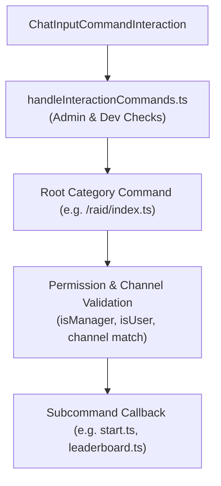

# Seraphina Command Architecture & Reference

Seraphina exposes Discord interactions through slash commands, message component collectors (buttons, select menus, modals), and text trigger prefixes (`s!`, `t!`).

---

## 1. Slash Command Subsystem Architecture

Commands are structured hierarchically under `src/commands/`:
* Each category folder contains an `index.ts` declaring the root slash command (e.g. `/raid`, `/lvl`, `/gq`).
* Subcommands are isolated in individual TypeScript files categorized under `subcommands/admin/`, `subcommands/user/`, and `subcommands/owner/`.
* `src/utils/fetchSubCommands.ts` scans the subcommand directory, building a unified `subcommandsMap` and permissions group arrays.

---

## 2. Slash Command Reference

### `/lvl` (Leveling & XP)
* **`/lvl rank [user]`**: Displays the user's level, total XP, and 1-based server rank on a custom profile card generated via `discord-arts`.
* **`/lvl leaderboard`**: Displays the top 10 server members ranked by Overall XP, Text XP, Voice XP, Weekly XP, or Monthly XP on a custom Canvas board (2600×1600) with interactive pagination (`⬅️`, `➡️`) and type dropdown.
* **`/lvl reset <user>`** *(Admin)*: Resets a member's XP and leveling data.
* **`/lvl channel <channel>`** *(Admin)*: Sets the designated channel for leveling notifications and rank cards.
* **`/lvl cooldown <seconds>`** *(Admin)*: Configures the XP message cooldown interval.

### `/raid` (Guild Boss Raids)
* **`/raid start <boss_1> [boss_2..5] [day] [time]`** *(Admin)*: Schedules a new guild raid. Posts an interactive embed with reaction/button registration for Tank, DPS, and Support roles, and schedules automated reminder timers.
* **`/raid scout <boss_buffs_image> <boss_debuffs_image>`** *(Admin)*: Updates raid reconnaissance data with boss element buffs/debuffs.
* **`/raid review <raid_id>`** *(Admin)*: Initiates an interactive thread to mark participants as present or absent, calculating member reliability ratings.
* **`/raid cancel <raid_id>`** *(Admin)*: Cancels a scheduled raid and notifies participants.
* **`/raid postpone <raid_id> <day> <time>`** *(Admin)*: Reschedules a raid to a new day and time.
* **`/raid ban <user> [reason]`** *(Admin)*: Bans a member from joining future guild raids.
* **`/raid unban <user>`** *(Admin)*: Removes a member from the raid ban list.
* **`/raid channel <channel>`** *(Owner)*: Configures the designated raid text channel.

### `/gq` (Guild Quests)
* **`/gq submit <screenshot>`** *(User)*: Submits a quest completion screenshot for admin verification. Prevents duplicate submissions using image perceptual hashing.
* **`/gq status`** *(User)*: Checks the status of pending, rewarded, or rejected submissions.
* **`/gq leaderboard`** *(User)*: Generates a 10-user canvas leaderboard of top guild quest contributors.
* **`/gq channel <channel>`** *(Owner)*: Sets the quest submissions channel.
* **`/gq reward-amount <amount>`** *(Admin)*: Sets the XP or currency reward amount per quest.

### `/mz` (Guild Maze)
* **`/mz submit <floor_start> <floor_end> <screenshots...>`** *(User)*: Submits maze run screenshots.
* **`/mz status`** *(User)*: Checks maze submission review status.
* **`/mz leaderboard`** *(User)*: Generates a canvas leaderboard of top maze climbers.
* **`/mz channel <channel>`** *(Owner)*: Sets the designated maze channel.

### `/ga` (Giveaways)
* **`/ga create`** *(Admin)*: Creates a scheduled giveaway with prize, entry requirements, duration, and eligible giveaway roles.
* **`/ga reroll <giveaway_id>`** *(Admin)*: Rerolls a new winner for an expired giveaway.
* **`/ga ban <user>`** *(Admin)*: Disqualifies a member from giveaway entries.

### `/mod` (Server & Bot Moderation)
* **`/mod setup`** *(Owner)*: Interactive checklist showing configuration status across all subsystems.
* **`/mod add-admin <user>`** *(Owner)*: Grants bot-admin status to a member.
* **`/mod remove-admin <user>`** *(Owner)*: Revokes bot-admin status.
* **`/mod mood [mood]`** *(Admin)*: Views or manually overrides Seraphina's active personality mood.
* **`/mod welcome-channel <channel>`** *(Admin)*: Configures greeting channel.
* **`/mod farewell-channel <channel>`** *(Admin)*: Configures farewell channel.
* **`/mod ban <user> [reason]`** *(Admin)*: Moderates member ban.
* **`/mod kick <user> [reason]`** *(Admin)*: Moderates member kick.

### `/community-support`
* **`/community-support create <target_amount> <reason>`** *(Admin)*: Creates a fundraising support campaign.
* **`/community-support channel <channel>`** *(Owner)*: Configures the community support channel.

---

## 3. Text Command Triggers

### `s! <query>` (Seraphina AI Assistant)
* **Trigger**: Message starting with `s!` or `S!` in any text channel.
* **Flow**:
  1. Checks for direct command intent via fuzzy match (`src/utils/commandKnowledgeBaseUtils.ts`). If matched, responds with command usage guidance.
  2. If image attachments are present, runs Gemini vision analysis (`seraphinaAnalyzeImage`).
  3. Otherwise, gathers memory context from Qdrant + MongoDB, combines with 20 recent channel messages, and generates a conversational reply styled according to Seraphina's current mood.
  4. Dispatches the interaction to the `CognitionQueue` for background memory formation.

### `t! <query>` (Toram Knowledge Query)
* **Trigger**: Message starting with `t!` or `T!`.
* **Flow**:
  1. Normalizes query text and strips stopwords.
  2. Runs fuzzy keyword matching via Fuse.js across `toramKnowledgeBase.json` to find the relevant guide PDF in `src/data/guides/`.
  3. Reads the PDF content and prompts Gemini to answer the player's Toram build or game mechanics query using verified guide data.
