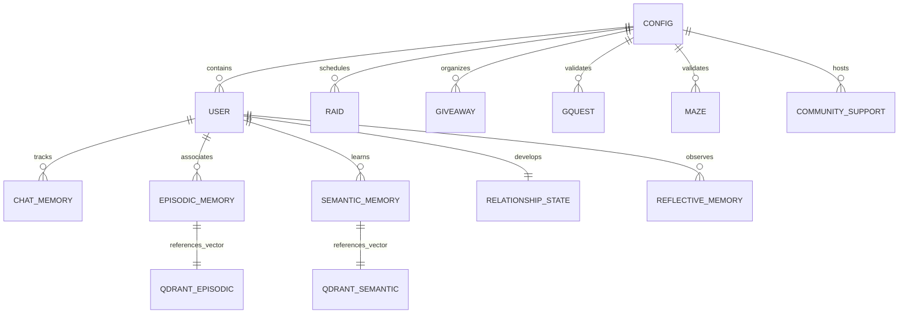

# Seraphina Database Architecture & Schemas

Seraphina uses a dual-database architecture:
1. **MongoDB (Mongoose)**: Manages relational application state, server configuration, user progress, community workflows, and structured memory documents.
2. **Qdrant Vector Database**: Manages dense 768-dimensional vector embeddings for episodic and semantic memory similarity search.

---

## 1. Storage Architecture Overview



---

## 2. MongoDB Mongoose Collections

### 1. Guild Configuration (`configs`)
* **Schema File**: [`src/models/configSchema.ts`](file:///D:/github%20projects/seraphina/discord-bot/src/models/configSchema.ts)
* **Primary Key**: `serverID: string` (Discord Guild ID).
* **Key Subdocuments**:
  * `levelConfig`: Roles, notification channels, ignored channels, XP cooldown, and XP multipliers (text, emoji, voice, attachments).
  * `moderationConfig`: Welcome/farewell channels and templates, ban/kick logs, and `botAdminIDs`.
  * `giveawayConfig`: Giveaway channels, roles, and blacklists.
  * `gquestMazeConfig`: Channels and submission threads for guild quest and maze screenshots.
  * `raidConfig`: Raid scheduling times, raid roles, manager roles, and role reaction emoji IDs.
  * `communitySupportConfig`: Support channel, manager roles, and active campaigns.
  * `moodConfig`: Seraphina's current active mood (`moodType`).
* **Caching & Indexes**:
  * In-memory cache in `src/utils/configCache.ts` with 60-second TTL.
  * Mongoose post-hooks on `save`, `findOneAndUpdate`, `updateOne`, `findOneAndDelete` automatically purge the cache on updates.

### 2. User Profiles (`users`)
* **Schema File**: [`src/models/userSchema.ts`](file:///D:/github%20projects/seraphina/discord-bot/src/models/userSchema.ts)
* **Indexes**:
  * `{ userID: 1, serverID: 1 }` (Unique compound index).
  * `{ serverID: 1, "leveling.totalXp": -1 }` (Compound index for fast rank calculation and leaderboards).
* **Key Subdocuments**:
  * `leveling`: `totalXp`, `textXp`, `voiceXp`, `level`, `currentRole`, `xpPerDay` (Map of date strings to XP earned).
  * `giveaways`: `giveawaysWon`, `giveawaysEntries`, `isBanned`.
  * `gquests`: `pending`, `rewarded`, `rejected`, `lastSubmissionDate`.
  * `mazes`: `pending`, `rewarded`, `rejected`.
  * `raids`: `completed`, `noShows`, `reliability` (Reliability score calculation from attendance).

### 3. Raids (`raids`)
* **Schema File**: [`src/models/raidSchema.ts`](file:///D:/github%20projects/seraphina/discord-bot/src/models/raidSchema.ts)
* **Purpose**: Coordinates 12-player guild boss battles.
* **Fields**:
  * `serverID`, `channelID`, `announcementMessageID`, `bannerUrl`.
  * `bosses`: Array of up to 5 bosses (`"roaring_thruma" | "dark_skull" | "bison" | "chimera" | "celdyte" | "soteria_the_celestial_halo"`).
  * `participants`: `{ tank: string[], dps: string[], support: string[] }`.
  * `waitlist`: `{ tank: string[], dps: string[], support: string[] }`.
  * `stage`: `"announced" | "scout_reminded" | "scouted" | "alloted" | "player_reminded" | "finished" | "reviewed" | "completed"`.
  * `raidTimestamps`: Timestamps for announcement, start, scout, allotment, finish, and review.

### 4. Guild Quests (`gquests`) & Mazes (`mazes`)
* **Schema Files**: [`src/models/guildQuestsSchema.ts`](file:///D:/github%20projects/seraphina/discord-bot/src/models/guildQuestsSchema.ts), [`src/models/mazeSchema.ts`](file:///D:/github%20projects/seraphina/discord-bot/src/models/mazeSchema.ts)
* **Fields**:
  * `serverID`, `userID`, `messageID`, `channelID`.
  * `imageUrl`, `imageHash`: Image attachment and perceptual image hash for duplicate submission detection.
  * `status`: `"pending" | "rewarded" | "rejected"`.
  * `reviewedBy`, `rejectionReason`.

### 5. Giveaways (`giveaways`) & Community Support (`communitysupports`)
* **Schema Files**: [`src/models/giveawaySchema.ts`](file:///D:/github%20projects/seraphina/discord-bot/src/models/giveawaySchema.ts), [`src/models/communitySupportSchema.ts`](file:///D:/github%20projects/seraphina/discord-bot/src/models/communitySupportSchema.ts)
* **Fields**:
  * Giveaways track prize, winners, eligible roles, entries, and expiration timestamp.
  * Community support tracks funding campaigns, target amounts, contributors, and completion status.

---

## 3. Cognitive Memory Models

Stored in MongoDB under `src/models/cognition/`:

### 1. Episodic Memories (`episodicmemorymodels`)
* **Schema File**: [`src/models/cognition/episodicMemorySchema.ts`](file:///D:/github%20projects/seraphina/discord-bot/src/models/cognition/episodicMemorySchema.ts)
* **Index**: `{ vector_embed_id: 1 }`
* **Fields**: `user_id`, `event`, `summary`, `significance`, `emotionalTone`, `emotions`, `times_recalled`, `vector_embed_id`.

### 2. Semantic Memories (`semanticmemorymodels`)
* **Schema File**: [`src/models/cognition/semanticMemorySchema.ts`](file:///D:/github%20projects/seraphina/discord-bot/src/models/cognition/semanticMemorySchema.ts)
* **Index**: `{ vector_embed_id: 1 }`
* **Fields**: `user_id`, `concept`, `statement`, `confidence`, `significance`, `emotionalIntensity`, `recallStrength`, `vector_embed_id`.

### 3. Relationship States (`relationshipstateschemas`)
* **Schema File**: [`src/models/cognition/relationshipStateSchema.ts`](file:///D:/github%20projects/seraphina/discord-bot/src/models/cognition/relationshipStateSchema.ts)
* **Key**: One document per `user_id`.
* **Fields**: `overallImpression`, `emotionalAssociations`, `perceivedTraits`, `communicationPatterns`, `attachmentLevel`, `trustLevel`, `familiarityLevel`, `emotionalSafety`, `recurringDynamics`, `insideJokes`, `relationshipNarrative`.

### 4. Reflective Memories (`reflectivememorymodels`)
* **Schema File**: [`src/models/cognition/reflectiveMemorySchema.ts`](file:///D:/github%20projects/seraphina/discord-bot/src/models/cognition/reflectiveMemorySchema.ts)
* **Index**: `{ user_id: 1, updatedAt: -1 }`
* **Fields**: `user_id`, `trigger`, `selfObservation`, `growth`, `createdAt`, `updatedAt`.

---

## 4. Qdrant Vector Collections

Qdrant is initialized at startup via `setupQdrant()` in [`src/cognition/vector/qdrant.ts`](file:///D:/github%20projects/seraphina/discord-bot/src/cognition/vector/qdrant.ts):

* **Vector Configuration**: Cosine distance metric, 768 dimensions (`text-embedding-004`).
* **Collections**:
  1. `episodic_memories`
  2. `semantic_memories`
* **Payload Structure**:
  ```json
  {
    "userID": "123456789012345678",
    "type": "episodic"
  }
  ```
* **Payload Index**: A keyword payload index is created on `userID` allowing rapid filtering during user-specific retrieval queries.
